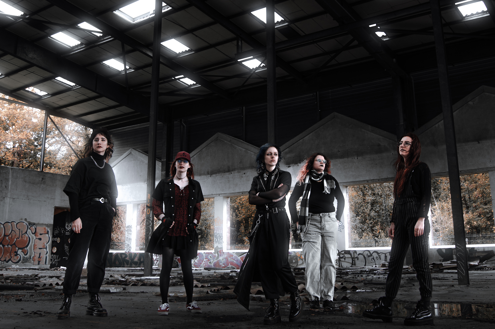

<h1 class="text-8xl m-0">MERCES</h1>

<h2 class="mt-0! mb-3">Métal queer et féministe</h2>

Au milieu d'une scène métal prédominée par des artistes masculins parfois problématiques, Merces est une bouffée d'air militante.

C'est une rage violente contre un système d'oppressions. C'est un cri du cœur porté par des queers féministes qui font face quotidiennement à ses conséquences. C'est un scream qui traduit la lourdeur de ces sujets : santé mentale, antifascisme, identité, lgbtphobies, féminicides...

Mais Merces, néo-divinité guide des personnes LGBTQIA+, porte aussi un message d'espoir : notre place est là, nos revendications seront entendues.

À la croisée des genres, les riffs dissonants et saturés de Merces s'inspirent aussi bien de black métal, death mélodique, que de mouvements plus récents avec des breaks à la metalcore. L'alternance du scream et du chant clair incarne aussi bien la colère enflammée du groupe que les émotions intenses qui l'alimentent.

## Media

<section class="grid grid-cols-1 gap-6  lg:grid-cols-[1fr_3fr]">
  <template v-for="media in data.media" :key="media.title">
    
{{ media.title }}

    

      
        {{ getIcon(l.type) }}
        <a :href="l.link" target="_blank">
          {{ l.title }}
        </a>
      
    

  </template>
</section>

## Photos

<ImageGallery :images="posts"/>

## Dates

<section class="flex flex-col *:m-0 gap-8 lg:gap-6">
  <article v-for="event in data.dates" :key="event.date">
    <header class="flex flex-col justify-between lg:flex-row">
      <h3 class="m-0 grid lg:grid-cols-[120px_auto] lg:gap-3">
        <strong>{{ formatDate(event.date) }}</strong>
        <a v-if="event.link" :href="event.link" target="_blank">{{ event.title }}</a>
        {{ event.title }}
      </h3>
      {{ event.venue }} ({{ event.city }})
    </header>
     — avec {{ event.lineup.join(', ') }}
     (organisé par {{ event.organizer }})
  </article>
</section>

## Booking

Nous sommes activement à la recherche de dates. Joignez-nous à *merces.band[at]proton.me*

Notre setlist dure **30 minutes**.

## Réseaux

<ul class="list-none m-0 p-0">
  <li v-for="link in data.links" :key="link.title">
    <a v-if="link.link" :href="link.link" target="_blank">{{ link.title }}</a>
    {{ link.title }}
    ·
    {{ link.link ?? link.info }}
  </li>
</ul>

<footer class="py-7 self-end text-xs">

➤ EPK via Loud&Queer
</footer>

